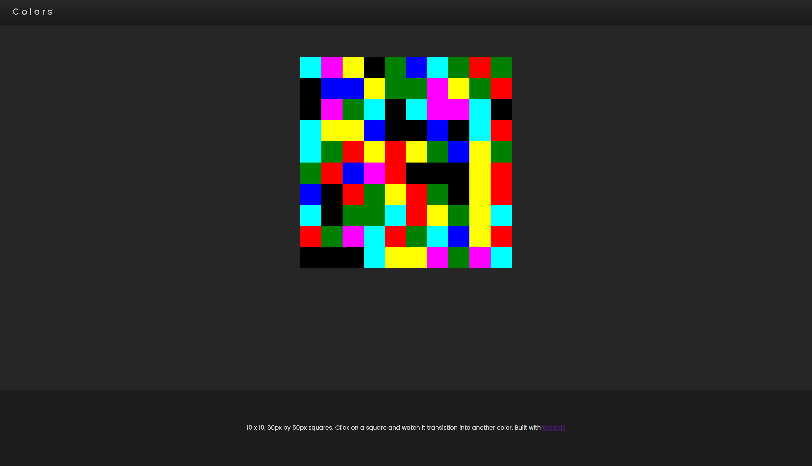

# colors-colors-colors
React App that display a 10 x 10 grid of 50px x 50px squares of 7 different colors. Hovering over a square will display the color name. Clicking on a square will change the color of the square.

**Screenshot**

* [ ] Install `live-server` if you haven't yet: `npm install -g live-server`
* [ ] Start the app by running `live-server .` from the root directory

## Owner
  - Chris Lardizabal

